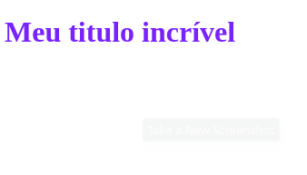
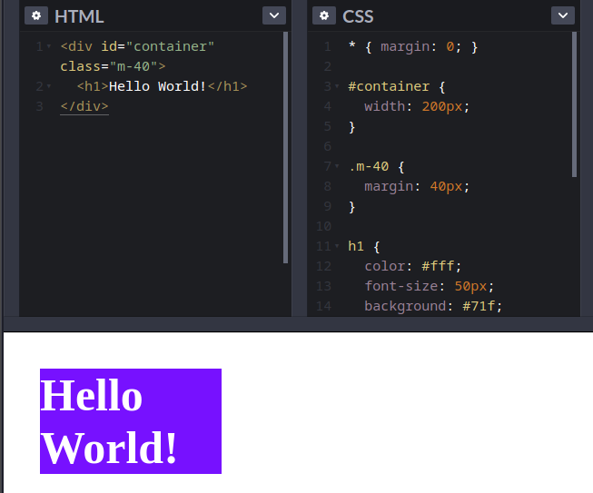

# Guia estelar de CSS3 🚀 🧑‍🚀

## Introdução

CSS (Cascading Style Sheet):

* Cascading Style Sheet (CSS);
* Código para criar estilo no HTML;
* HTML é a estrutura, e o CSS a beleza;
* NÃO é uma linguagem de programação;
* É uma LINGUAGEM DE STYLE SHEET.

## Vamos ao exemplo 

```html
<h1>Meu titulo incrível</h1>
```

```css
h1 {
  color: #72f;
}
```




## Comentários no CSS

Comentários começam com `/*` e terminam com `*/`. Ele não afeta nosso código. Pode nos ajudar com:

* Organização de código; 

```css
/* Esse é meu comentário incrível! */
h1 {
  color: #72f;
}
```

* Agrupamento de código;
* Melhor entendimento de um bloco de código;
* Ajuda a lembrar o que você fez;
* Ajuda outros a entenderem;
* Nunca esqueça de **fechar** um comentário aberto;
* Desabilitar parte de nosso código;

```css
/* Esse é meu comentário incrível! */
/*
  h1 {
   color: #72f;
  }
*/
```

## Anatomia

```html
  <h1>Hello World!</h1>
```

```css
h1 {
 color: #fff;
 font-size: 60px;
 background: #72f;  
}
```

* Selector
* Declaration
* Properties
* Property Value

## Selectors

Conecta um elemento  HTML com o CSS

### Tipos

* Global selector `*`
* Element/Type Selector `h1, h2, p, div`
* ID selector `#box, #container`
* Class selector `.red, .m-4`
* Attribute selector, Pseudo-class, Pseudo-element, e outros.



## Caixas

* Você irá perceber que (quase) tudo são caixas do CSS;
* Posicionamentos, tamanho, espaçamentos, bordas, cores;
* Caixa pode ao lado de uma outra, ou acima;
* Elementos HTML são caixas.

## Adicionando CSS

### Inline

* Atributo `style`

### &lt;style&gt;

* Tag HTML que irá conter o CSS

### &lt;link&gt;

* Arquivo css externo
  
### @import

* Arquivo css externo

## A cascata (cascading)

A escolha do browser de qual regra aplicar, caso haja muitas refras para o mesmo elemento.

* estilo lido de cima para baixo

É levado em consideração 3 fatores:

1. Origem do estilo
2. Especificidade
3. Importancia

### Origem do estilo

inline > tag style > tag link

### Especificidade

É um calculo matemático, onde, cada tipo de seletor e origem de estilo, possuem valores a serem considerados.

* 0 = Universal selector, combinators e negations pseudo-class (:not())
* 1 = Element type selector e pseudo-element(::beafore ::after)
* 10 = Classes e attribute selectors (`[type="radio"]`)
* 100 = ID selector
* 1000 = Inline

### Regra !important

* Cuidado, evite o uso
* Não é considerado uma boa prática
* Quebra o fluxo natural da cascata
 
## At-rules

* Está relacionado coim o comportamento do CSS
* começa com o sinal de `@` segindo o identificador e o valor

### Exemplos comuns

* @import `/* incluir um CSS externo */`;
* @media `/* regras condicionais de dispositivos */`;
* @font-face  `/* fontes externas */`;
* @keyframe `/* Animation */`.
  
```css
@import url('https://local.com/style.css');

@media (min-width: 500px) {
  /* rules here */
}

@font-face {
  /* rules here */ 
}

@keyframe nameofanimation {
   /* rules here */
}
```

## Shorthand

* Junção de propriedades
* Resumido
* Legivel

```css
{
  background-color: #000;
  background-image: url(img/bg.gif);
  background-repeat: no-repeat;

  /* background shorthand */
  background: #000 url(img/bg.gif) no-repeat left top;

  /* font properties */
  font-style: italic;
  font-weight: bold;
  font-size: .8em;
  line-height: 1.2;
  font-family: Arial, sans-serif;

  /* font shorthand */
  font: italic bold .8em/1.2 Arial, sans-serif;
}
```

### Detalhes

* Não vai considerar propriedades anteriores
* Valores não especificados irão assumir o valor padrão
* geralmente, a ordem descrita não importa, mas, se houver muitas propriedades semelhantes com valores semelhantes, podemos encontrar problemas

### Propriedades que aceitem shorthand

>***Shorthand properties:*** animation, background, border, border-bottom, >border-color, border-left, border-radius, border-right, border-style, border-top, >border-width, column-rule, columns, flex, flex-flow, font, grid, grid-area, >grid-column, grid-row, grid-template, list-style, margin, offset, outline, >overflow, padding, place-content, place-items, place-self, text-decoration, transition [MDN - Shorthand CSS](https://developer.mozilla.org/en-US/docs/Web/CSS/Shorthand_properties).

## Funções

* nome seguido de abre e fecha parentesis
* recebe argumentos

### Exemplo

```css
@import url("https://urlaqui.com/style.css");

{
  color: rgb(255, 0, 100);
  width: calc(100% - 10px);
}
```

## Vendor Prefixes

Permite que browsers adicione `features`, a fim de  colocramos nividades que vemos no css.

### Exemplos

```css
p {
  -webkit-background-clip: text;  /* Chrome, Safari, IOS e Android */ 
  -moz-background-clip: text;    /* Mozilla (Firefox) */
  -ms-background-clip: text;    /* Internet Explorer */
  -o-background-clip: text;    /* Opera */
}
```

### Consulta 

* [ireade](http://ireade.github.io/which-vendor-prefix/)
* [caniuse](https://caniuse.com)